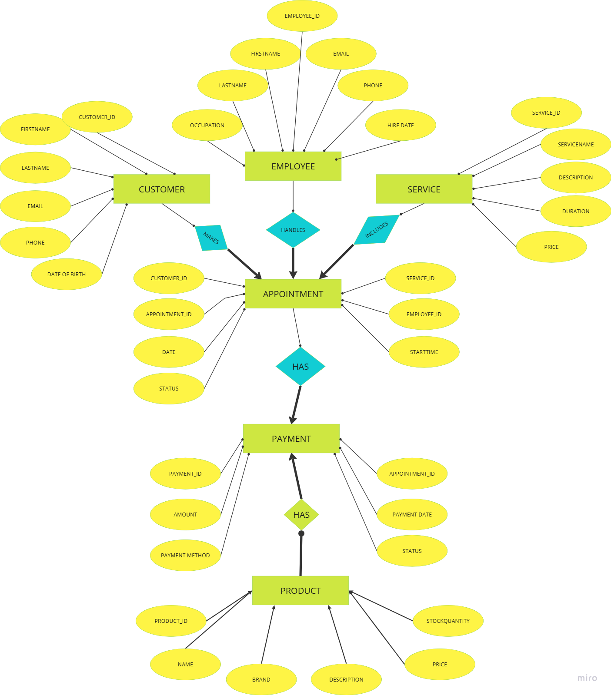

# Datenbank-Dokumentation-Ladenverwaltung
Projekt für das Modul: DATENHALTUNG
Studierende:r: AESHA VERMA
Semester: Sommersemester 2025
### Projektbeschreibung
Dieses Projekt wurde im Rahmen eines Universitätskurses zur Einführung in Datenbanksysteme durchgeführt. Ziel war es, ein relationales Datenbankschema für ein fiktives Geschäft zu entwerfen, in MySQL umzusetzen und typische Anwendungsfälle wie Datenabfragen, Trigger und Schema-Erweiterungen zu realisieren.

Da dies meine erste praktische Erfahrung mit SQL war, habe ich besonderes Augenmerk auf die Nachvollziehbarkeit des Workflows und die saubere Strukturierung des Codes gelegt. Alle SQL-Dateien wurden getestet und sind vollständig lauffähig in MySQL Workbench (Version ≥ 8.0).

Inhaltsverzeichnis
1.Geschäftsbeschreibung & Kernprozesse
2.Datenentitäten & ER-Diagramm
3.Relationales Schema & SQL-Datenbank
4.SQL-Abfragen
5.Aktualisierung & Trigger
6.Schema-Erweiterung
7.Wahl der relationalen Datenbank
8. Kund:innenbefragung

###  1: Geschäftsbeschreibung & Kernprozesse
Der Friseursalon von meinem Klassenkamaraden steht für Stil, Entspannung und individuelle Beratung. Mit modernen Techniken und hochwertigen Produkten sorgen der dafür, dass jeder Kunde*in sich wohlfühlt und mit einem perfekten Look den Salon verlässt – ob klassisch oder trendig, bei denen ist man in besten Händen. Dienstleistungen wie Haarschnitt, Haarfärbung, Pflegebehandlungen, Styling und Maniküren sowie Pediküren werden standardmäßig angeboten. Zudem werden Produkte wie Professionelle Shampoos/Spülung, Färbungs- und Blondierungsmittel und Guntscheine verkauft. 
### Die Wichtigsten Processe in einem Friseursalon:
 | Prozess      | Eingabedaten | Ausgabedaten|
 |:------------------|:----------|:---------|
 |1. Terminvereinbarung|Kundenname, Dienstleistung, Datum|Bestätigter Termin, Stylist
 |2. Zahlungsabwicklung|Termin-ID, Betrag, Zahlungsmethode|Zahlungsbeleg, Buchung in Finanzdaten
 |3. Kundenpflege|Kunden-ID, Bewertungen|Loyalitätspunkte, Kundenfeedback
 |4. Lagerverwaltung|Produkt-ID, Produktname, Lagerbestand|Aktueller Bestand, Bestellstatus

###  2: ER- Diagram für den Friseursalon
 

 ### Relationales Schema
 <u>Customer</u> : {[CustomerID : Integer, FirstName : String, LastName : String, Email : String, Phone : String, DateOfBirth : DATE]}

<u>Employee</u> : {[EmployeeID : Integer, FirstName : String, LastName : String, Email : String, Phone : String, HireDate : DATE, Specialization : String]}

<u>Service</u> : {[ServiceID : Integer, ServiceName : String, Description : TEXT, Duration : Integer, Price : DECIMAL(10,2)]}

<u>Product</u> : {[ProductID : Integer, Name : String, Brand : String, Description : TEXT, Price : DECIMAL(10,2), StockQuantity : Integer]}

<u>Appointment</u> : {[AppointmentID : Integer, CustomerID : Integer, EmployeeID : Integer, ServiceID : Integer, Date : DATE, StartTime : TIME, Status : String]}

<u>Payment</u> : {[PaymentID : Integer, AppointmentID : Integer, Amount : DECIMAL(10,2), PaymentDate : DATETIME, PaymentMethod : String, Status : Strin]}

<u>PaymentProduct</u> : {[PaymentID : Integer, ProductID : Integer, Quantity : Integer]}

### 3 :  Integritätsbedingungen zur Sicherstellung von Datenqualität
Das Datenbankschema "salondb" enthält mehrere Integritätsbedingungen, um die Datenqualität sicherzustellen. Primary Key einschränkungen wie AUTO_INCREMENT für Felder wie CustomerID und EmployeeID identifizieren jeden Datensatz eindeutig und verhindern Duplikate. Foreign key einschränkungen wie die in den Tabellen Appointment, Payment und PaymentProduct erhalten gültige Relationen zwischen Tabellen aufrecht. NOT NULL-Einschränkungen für kritische Felder wie FirstName, LastName und Email stellen sicher, dass immer wichtige Daten bereitgestellt werden. UNIQUE-Einschränkungen für die Email-Felder in den Tabellen Customer und Employee verhindern doppelte E-Mails. Standardwerte wie „Scheduled“ für den Terminstatus und „Ausstehend“ für den Zahlungsstatus stellen Konsistenz sicher. Datentypeinschränkungen wie DECIMAL für Preise und DATE für zeitliche Daten stellen korrekte Formatierung sicher. Zusammen verhindern diese Einschränkungen Inkonsistenzen, erhalten Beziehungen aufrecht, stellen Vollständigkeit sicher, erleichtern die Berichterstellung und unterstützen Geschäftsabläufe.

###  4 : Abfragen
(code in der abfragen.sql datei)
###  5 : Aktualisierung Eintrag & Trigger
(code in der abfragen.datei)

###  6 :  Erweiterung des Schema
Lohn- und Gehaltsabrechnung: Die Spalte "Salary" wäre nützlich, um Gehaltsabrechnungen zu erstellen, Mitarbeiter zu bezahlen oder sicherzustellen, dass der Salon finanziell gesund bleibt.
(code in der abfragen.datei)
###  7 : Relationale Datenbanken vs. NoSQL-Datenbanken
Für dieses Salon-Management-System ist eine traditionelle relationale Datenbank sinnvoller, vor allem, weil sie die Beziehungen zwischen Entities (z. B. Termine im Zusammenhang mit Kunden, Mitarbeitern und Dienstleistungen) mit den erforderlichen foreign - Key - contraints, ACID-Compliance für kritische Geschäftsvorgänge (z. B. die Koordination von Terminen und Zahlungen) klar definiert und konsistent strukturierte Daten verwendet, bei denen jede Entity über vorhersehbare Felder und Datentypen verfügt. MongoDB wäre die bessere Wahl, wenn sein Salongeschäft eine flexiblere Datenspeicherung benötigt - zum Beispiel, wenn er verschiedene Arten von Kundenprofilen speichern, Millionen von Terminen an mehreren Standorten bearbeiten, Fotospeicher für Styling-Ergebnisse hinzufügen oder eine funktionsreiche mobile App erstellen möchte. In diesen Fällen wäre die Fähigkeit von MongoDB, unstrukturierte Daten zu verarbeiten und einfach zu skalieren, wertvoller als die starre Struktur einer herkömmlichen Datenbank.

###  8: Kundenbefragung
Für die Kundenbefragung im Friseursalon bieten sich zwei Stichprobenverfahren an: Die stratifizierte Zufallsstichprobe, bei der Kunden nach Kriterien wie Alter, Geschlecht oder Dienstleistungstyp in Gruppen eingeteilt und proportional ausgewählt werden, garantiert Repräsentativität und Vielfalt; Vorteile sind eine gezielte Kundenabdeckung, Nachteile können erhöhter Aufwand und komplexere Durchführung sein. Die systematische Zufallsstichprobe, bei der jeder n-te Kunde zufällig ausgewählt wird, ist einfacher zu implementieren, mit dem Vorteil der leichten Durchführbarkeit, aber dem Nachteil möglicher Verzerrungen, wenn unbeabsichtigt bestimmte Kundengruppen über- oder unterrepräsentiert werden.
